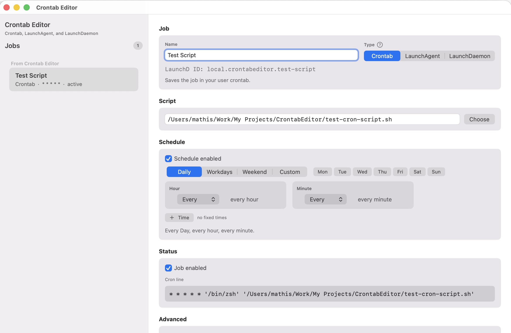

# Crontab Editor

A minimal native macOS SwiftUI editor for user cron jobs, LaunchAgents, and LaunchDaemons.



## Supported Systems

Crontab Editor is a native macOS app.

- macOS 14 Sonoma or newer
- Apple Silicon and Intel Macs
- Local user crontabs through `/usr/bin/crontab`
- User LaunchAgents under `~/Library/LaunchAgents`
- System LaunchDaemons under `/Library/LaunchDaemons`
- English by default, with a German app translation when the system language is German

Linux, Windows, iOS, and iPadOS are not supported. The app depends on AppKit, SwiftUI for macOS, `launchctl`, `osascript`, and the macOS launchd directory layout.

## Download and Install

For normal use, download the latest `CrontabEditor.zip` from the GitHub Releases page:

https://github.com/morja/CrontabEditor/releases

Then:

1. Unzip `CrontabEditor.zip`.
2. Move `CrontabEditor.app` to `/Applications`.
3. Open the app.

If macOS blocks the first launch because the app was downloaded from the internet, open **System Settings > Privacy & Security** and allow the app there.

If macOS still refuses to open the app, remove the quarantine attribute:

```sh
sudo xattr -dr com.apple.quarantine /Applications/CrontabEditor.app
open /Applications/CrontabEditor.app
```

The downloadable app is ad-hoc signed, not notarized. That means it can run, but macOS may still show Gatekeeper warnings on first launch. A fully public distribution would need Apple Developer ID signing and notarization.

You do not need Xcode, Swift, or SwiftPM to use the downloaded app.

## Runtime Permissions

- Editing normal crontab jobs uses your user account.
- Creating or changing LaunchAgents uses your user account.
- Creating, changing, loading, or starting LaunchDaemons requires an admin password because they are installed under `/Library/LaunchDaemons` and can run without a user being logged in.

## Crontab Backups

Before every crontab save, Crontab Editor writes a backup of the previous user crontab to:

```text
~/Library/Application Support/CrontabEditor/Backups
```

Backups are named like `crontab-20260528-153000-UUID.backup`. Crontab Editor keeps the 10 newest backups and removes older ones automatically. The folder can also be opened from the app through **Crontab Editor > Settings > Open Backup Folder**.

## Build Requirements

These are only needed if you want to build the app yourself from source:

- Xcode or Apple Command Line Tools with Swift 6.1 or newer
- Terminal access to `swift`, `crontab`, `launchctl`, `codesign`, and `ditto`
- Admin rights when creating, changing, loading, or starting LaunchDaemons

## Build from Source

```sh
swift run
```

If no window appears when running through SwiftPM, build and open the app as a real macOS bundle:

```sh
chmod +x Scripts/build-app.sh
Scripts/build-app.sh
open .build/CrontabEditor.app
```

The script builds a release binary by default and signs the app ad hoc:

```sh
codesign --verify --deep --strict .build/CrontabEditor.app
```

Ad-hoc signing is useful for local testing and direct sharing. For public distribution without Gatekeeper warnings, you also need an Apple Developer ID signature and notarization.

When sharing with another Mac, copy the ZIP file instead of the raw `.app` folder:

```sh
.build/CrontabEditor.zip
```

The ZIP is created with `ditto --keepParent` so the bundle structure and executable permissions are preserved.

## Current Scope

- Read multiple cron jobs from the user crontab
- Show app-managed and external jobs in separate groups
- Read LaunchAgent jobs from `~/Library/LaunchAgents`
- Read LaunchDaemon jobs from `/Library/LaunchDaemons`
- Optionally show external jobs
- Edit and save external crontab jobs
- Keep external LaunchAgent and LaunchDaemon jobs read-only when saving
- Add new jobs and edit existing parseable jobs
- Choose `Crontab`, `LaunchAgent`, or `LaunchDaemon` per job
- Name each job; launchd uses that name to create a stable ID like `local.crontabeditor.my-job`
- Enter the script path manually or choose it with a file picker
- Add optional ProgramArguments; launchd stores them as a real `ProgramArguments` array
- Optionally run a script through `/bin/sh`, `/bin/bash`, `/bin/zsh`, or a custom shell/interpreter path
- Use the custom macOS app icon in the bundle
- Configure flexible schedules:
  - multiple weekdays, including workday and weekend presets
  - specific hour, every hour, or every N hours
  - specific minute, every minute, or every N minutes
  - multiple fixed times per day
- Use `RunAtLoad` to start immediately when loaded
- Use `Run now` to start the selected job immediately
- Use advanced settings for optional logging and labeled stdout/stderr log paths
- Create an automatic backup before every crontab save
- Enable or disable jobs
- Disable the schedule so a job only starts through `RunAtLoad` or `Run now`
- Preview the cron line before saving
- Preserve comments, blank lines, and unparseable crontab lines
- Save as a normal user crontab
- Write LaunchAgent plists and load them through `launchctl bootstrap/bootout`
- Install LaunchDaemon plists through an admin prompt, set `root:wheel`/`644`, and load them through `launchctl bootstrap system`

Example:

```cron
0 2 * * * '/Users/mathis/bin/example.sh'
# 0 * * * * '/Users/mathis/bin/disabled.sh'
```

## Notes

The app can edit simple cron expressions: `*`, concrete numbers, and `*/N` for minute and hour. More complex cron syntax is kept as an unparseable line.

Saving rewrites the user crontab. Unparseable lines, comments, and blank lines are preserved. Parseable external crontab lines are shown as jobs and may be rewritten in the app-generated form after saving.

LaunchAgent and LaunchDaemon plists are edited directly only when their label starts with `local.crontabeditor.`. Other LaunchAgent and LaunchDaemon jobs can be shown optionally, but remain read-only.

LaunchAgents are user-scoped. LaunchDaemons are system-wide and can run without a login session, but require admin rights. The current implementation uses the macOS admin prompt through AppleScript. A signed privileged helper tool would be cleaner for a distributable product.

The app is not notarized. Locally built app bundles are ad-hoc signed and may trigger Gatekeeper warnings on other Macs.

## Practical Future Schedules

- Start at login (`RunAtLoad`)
- Every N seconds/minutes/hours (`StartInterval`)
- Multiple fixed times per day
- Multiple weekdays
- Specific day of month
- Specific month or date combinations
- Start after network or path availability (`WatchPaths`, `QueueDirectories`)
- Create a one-shot job for the next scheduled time, then disable it
